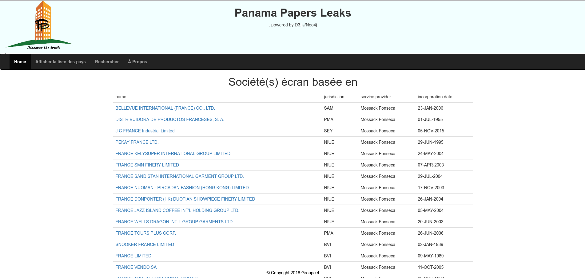

# Projet_Technologique
Projet technologique Panama Papers S6

# Membres
ANDRIANIRINA Diane
DELAR Emmanoé
SADOURI Massinissa

# Description :

<p align="center">
	
  
  
</p>

# Pré-requis :
Le dossier import/

dézipper le fichier ./zip/import et copier le dans votre dossier /neo4j/ (assurez vous au préalable que votre serveur soit stoppé)

> `unzip data/zip/import.zip`

> `mv import/ ~/{localisation de votre neo4j}/`

# Création la base de données Neo4J
Il y a 2 méthodes pour créer la base de données.

## Méthode 1 : Copier puis charger la bdd

dézipper le fichier data/zip/graph.db.zip et déplacer le dans votre dossier neo4j data/databases/ (assurez vous au préalable que votre serveur soit stoppé)

> `unzip data/zip/graph.db.zip`

> `mv graph.db ~/{localisation de votre neo4j}/data/databases/`

Puis charger le reste des données à partir des requêtes Cypher

> `neo4j start`

Connectez vous à http://localhost:7474/ si ce n'est pas déja fait

##### Création des index

À partir de la command shell de Neo4j browser, lancez les requêtes suivantes. Elles indexeront les données afin de faciliter le parcours de la bdd

> `CREATE INDEX ON:entity(id)`

> `CREATE INDEX ON:address(id)`

> `CREATE INDEX ON:intermediary(id)`

> `CREATE INDEX ON:officer(id)`

Puis lancer les derniers chargements

##### Chargement des addresses

```USING PERIODIC COMMIT 10000
LOAD CSV WITH HEADERS FROM 'file:///panama_papers.nodes.address.csv' AS line
FIELDTERMINATOR ','
WITH line
MERGE (ad:address)
SET ad.id = line.`n.node_id` SET ad.countries = line.`n.countries` SET ad.address = line.`n.address` SET ad.sourceID =line.`n.sourceID` SET ad.country_codes =line.`n.country_codes` SET ad.service_provider =line.`n.service_provider`  SET ad.jurisdiction_description =line.`n.jurisdiction_description`  SET ad.jurisdiction=line.`n.jurisdiction` SET ad.closed_date=line.`n.closed_date` SET ad.incorporation_date=line.`n.incorporation_date` SET ad.ibcRUC=line.`n.ibcRUC` SET ad.type=line.`n.type` SET ad.status=line.`n.status` SET ad.company_type=line.`n.company_type` SET ad.note=line.`n.note`
```

##### Chargement des intermediares

```USING PERIODIC COMMIT 10000
LOAD CSV WITH HEADERS FROM 'file:///panama_papers.nodes.intermediary.csv' AS line
FIELDTERMINATOR ','
WITH line
MERGE (in:intermediary{node_id:line.`n.node_id`})
SET in.id = line.`n.node_id` SET in.country_code = line.`n.country_codes` SET in.countries = line.`n.countries` SET in.address = line.`n.address` SET in.status = line.`n.status` SET in.sourceID =line.`n.sourceID` SET in.valid_until=line.`n.valid_until`
```

##### Chargement des relations

```
LOAD CSV WITH HEADERS FROM 'file:///officer_of.csv' AS line
FIELDTERMINATOR ','
WITH line        
match (p1:officer) where p1.id = line.`Node_1`
match (p2:entity) where p2.id = line.`Node_2`
MERGE (p1)-[r:officer_of{type:line.`rel_type`}]->(p2) SET r.sourceID=line.`r.sourceID` SET r.valid_until=line.`r.valid_until` SET r.start_date=line.`r.start_date` SET r.end_date=line.`r.end_date`
```

```
LOAD CSV WITH HEADERS FROM 'file:///intermediary_of.csv' AS line
FIELDTERMINATOR ','
WITH line        
match (p1:intermediary) where p1.id = line.`Node_1`
match (p2:entity) where p2.id = line.`Node_2`
MERGE (p1)-[r:intermediary_of{type:line.`rel_type`}]->(p2) SET r.sourceID=line.`r.sourceID` SET r.valid_until=line.`r.valid_until` SET r.start_date=line.`r.start_date` SET r.end_date=line.`r.end_date`
```

```
LOAD CSV WITH HEADERS FROM 'file:///address.csv' AS line
FIELDTERMINATOR ','
WITH line        
match (p1:entity) where p1.id = line.`node_1`
match (p2:address) where p2.id = line.`node_2`
MERGE (p1)-[r:address{type:line.`rel_type`}]->(p2) SET r.sourceID=line.`r.sourceID` SET r.valid_until=line.`r.valid_until` SET r.start_date=line.`r.start_date` SET r.end_date=line.`r.end_date`
```

## Méthode 2 : Charger entièrement la bdd (plus de 24h de chargement pour chacune des 2 premieres requetes)

##### Chargement des entités

```USING PERIODIC COMMIT 10000
LOAD CSV WITH HEADERS FROM 'file:///panama_papers.nodes.entity.csv' AS line
FIELDTERMINATOR ','
WITH line
WHERE line.`n.name` IS NOT NULL
MERGE (en:entity{name:line.`n.name`})
SET en.id = line.`n.node_id` SET en.countrycodes = line.`n.country_codes` SET en.address = line.`n.address` SET en.valid_until = line.`n.valid_until`
SET en.countries = line.`n.countries` SET en.sourceID = line.`n.sourceID` SET en.jurisdiction_description = line.`n.jurisdiction_description` SET en.service_provider = line.`n.service_provider` SET en.jurisdiction =line.`n.jurisdiction`  SET en.incorporation_date =line.`n.incorporation_date` SET en.ibcRUC =line.`n.ibcRUC`  SET en.status =line.`n.status`
```

##### Chargement des officiers

```USING PERIODIC COMMIT 10000
LOAD CSV WITH HEADERS FROM 'file:///panama_papers.nodes.officer.csv' AS line
FIELDTERMINATOR ','
WITH line
WHERE line.`n.name` IS NOT NULL
MERGE (n:officer{name:line.`n.name`})  //!\\ merge les id et non les names !!!
SET n.id = line.`n.node_id` SET n.countrycodes = line.`n.country_codes` SET n.valid_until=line.`n.valid_until` SET n.sourceID =line.`n.sourceID`
```

##### Puis finissez le chargement des données en reprenant les étapes de la méthode 1 à partir de la création des index
